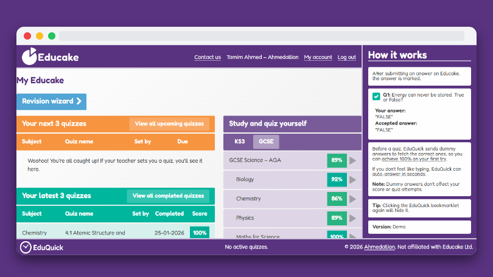
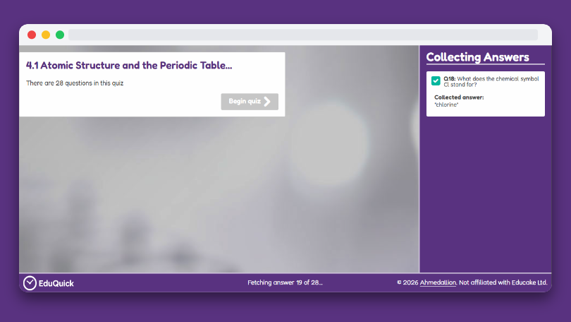

# Collect answers and complete Educake quizzes faster

EduQuick is a bookmarklet for **[Educake](https://www.educake.co.uk){:target="\_blank" rel="noopener"}** that helps you save time on repetitive quizzes by collecting answers before you start and optionally auto-completing them.

It is designed for **students**, is easy to install, and works directly in your browser.

[Get Started](installation){: .btn .btn-purple .mr-2 }
[View it on GitHub](https://github.com/Ahmedallion/EduQuick){: .btn .mr-2 target="_blank" rel="noopener" }

---

## 📸 Demo & Screenshots

### User Interface

A clean, non-intrusive overlay that sits directly on your Educake dashboard.

### Answer Collection

View a real-time overview of the data EduQuick is gathering as you navigate.

### Auto-Answer Flow

Enable auto-answer to answer questions instantly.

---

## 📚 What’s in these docs?

- Step-by-step installation guides (desktop & mobile)
- Troubleshooting help when something doesn’t work
- Known issues and Educake update breakages
- How to update EduQuick when required

---

## ⚡ Quick Start

### 1. Download Bookmarklet

Download the installer file to your computer.

[Download EduQuick HTML](https://github.com/Ahmedallion/EduQuick/blob/main/install/eduquick.html){: .btn .btn-purple target="\_blank" rel="noopener"}

### 2. Open Bookmarks Manager

Open your browser's manager by typing `chrome://bookmarks` or `edge://favorites` in the address bar.

### 3. Import the Bookmark

Click the **three dots** (options menu), select **Import bookmarks**, and choose the `eduquick.html` file you just downloaded.

### 4. Run EduQuick

Go to [Educake](https://www.educake.co.uk){:target="\_blank" rel="noopener"}, log in, and click **EduQuick** from your bookmarks bar.

 

{: .note }

> **Tip:** If the quick start steps don't match your browser, visit the full [Installation](installation) guide for detailed device-specific instructions.

---

## 🔗 Project Links

- [GitHub Repository](https://github.com/Ahmedallion/EduQuick){:target="\_blank" rel="noopener"}
- [Get Help](get-help)
