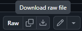
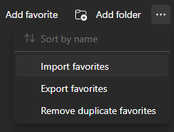
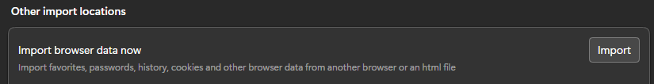
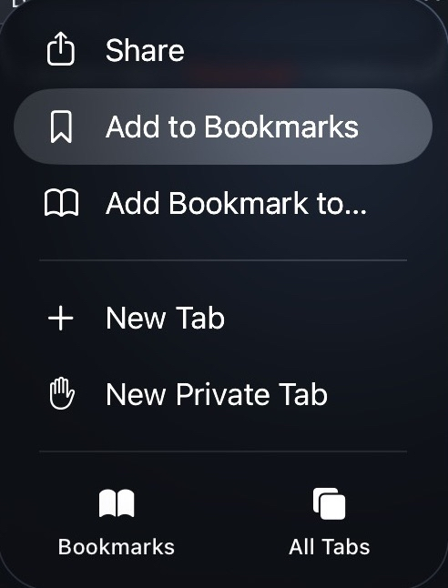
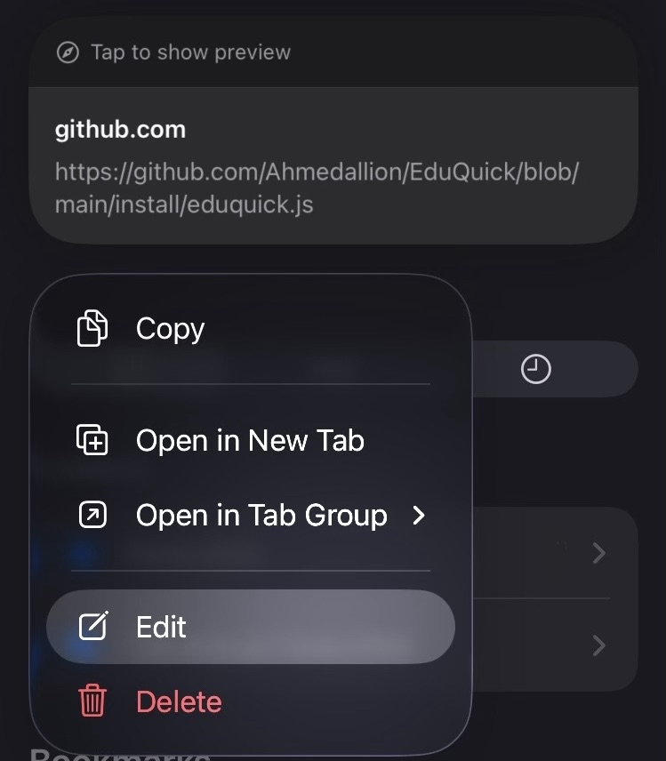
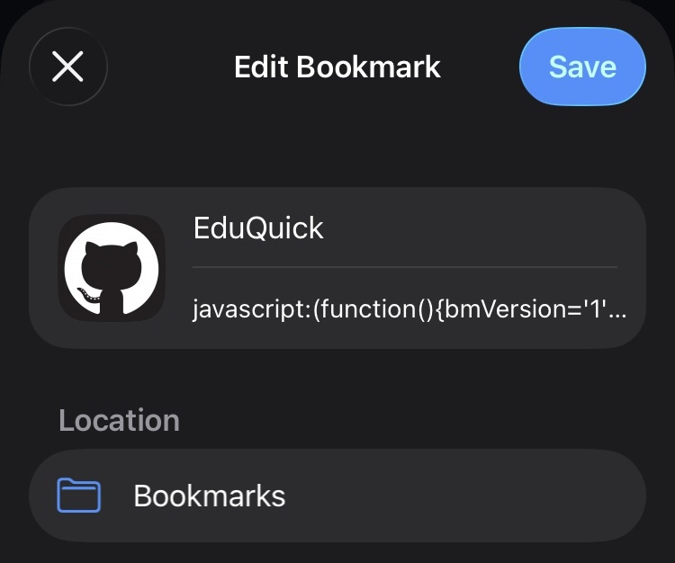

# Installing EduQuick

This guide will help you set up **EduQuick** on your device.

Select your device below:

---

## 💻 Desktop

Click a browser to jump to its instructions:

  <a href="#chrome"> Chrome / Chromium</a>  
  <a href="#edge"> Edge</a>  
  <a href="#chrome"> Brave</a>  
  <a href="#chrome"> Opera</a>  
  <a href="#chrome"> Vivaldi</a>  
  <a href="#alternative"> Not Listed</a>

> **Note:** Brave, Opera, and Vivaldi are Chromium-based; follow the **Chrome instructions**.

---

## 📱 Mobile

Click a device to jump to instructions:

  <a href="#ios"> iOS Safari</a>  
  <a href="#android"> Android</a>

---

## 💻 Desktop Instructions

### Chrome / Chromium-based Browsers 

1. **Download** [`eduquick.html`](https://github.com/Ahmedallion/EduQuick/install/eduquick.html)
   
2. Open bookmarks manager:
   `chrome://bookmarks`
3. Ensure **Show bookmarks bar** is enabled:
   `Ctrl`+`Shift`+`B`
4. Click the three dots → **Import bookmarks**
    
5. Wait for page to load
6. In dropdown, select **Bookmarks HTML file** and Tick **Bookmarks / Favorites** box
   
7. Click **Choose file**, select `eduquick.html`, **Open**
8. EduQuick bookmarks appear in your bookmarks bar
9. Organise via bookmarks manager if needed

---

### Edge 

1. **Download** [`eduquick.html`](https://github.com/Ahmedallion/EduQuick/install/eduquick.html)
   
2. Open bookmarks manager: `edge://favorites`
3. Enable **Show favorites bar → Always**
   
4. Click three dots → **Import favorites**
   
5. Wait for page to load
6. Click **Import** next to where it says **Import browser data now**
   
7. Select **Favorites or bookmarks HTML file** and Tick **Favorites / Bookmarks**
   
8. Click **Choose file**, select `eduquick.html`, **Open**
9. EduQuick bookmarks appear in the favorites bar
10. Organise via favorites manager if needed

---

### Not Listed / Other Browsers 

- For browsers not listed above, or if the HTML import doesn’t work, use the **JS bookmarklet method** (same as mobile):
    1. Open [`eduquick.js`](https://github.com/Ahmedallion/EduQuick/install/eduquick.js) and copy all code
    2. Create a bookmark called **EduQuick** and paste the JS as the URL
    3. Log in to **Educake**
    4. Click the bookmark to run

---

## 📱 Mobile Instructions

### iOS Safari 

1. Open [`eduquick.js`](https://github.com/Ahmedallion/EduQuick/install/eduquick.js)
2. Copy all the code
   
3. Bookmark the EduQuick GitHub page via three dots → **Add to Bookmarks**
   
   
4. Open bookmarks → find the new bookmark → **Edit**
   
5. Change name to **EduQuick**, clear URL field, paste JS, **Save**
   
6. Log in to **Educake**
7. Tilt device **horizontally** and zoom out fully
8. Open bookmarks → select **EduQuick** → script runs

---

### Android (Strongly Discouraged)

1. Bookmark the EduQuick repository
   
2. Every time you want to run it:
    - Copy the JS from [`eduquick.js`](https://github.com/Ahmedallion/EduQuick/install/eduquick.js) (saved as a bookmark)
      
    - Log in to **Educake**
    - Tilt horizontally and zoom out
    - In active Educake tab, clear URL and paste the JS (ensure it starts with `javascript:`)
      
    - Press **Go / Enter** → EduQuick runs

---

## ✅ Tips

- Chromium-based browsers not listed follow **Chrome instructions**
- Always log in to **Educake** before running EduQuick
- For mobile, **horizontal orientation + zooming out** ensures UI fits
