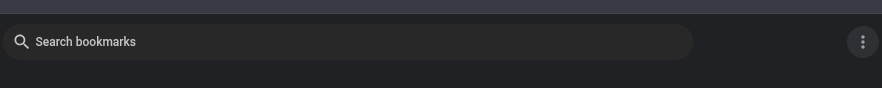
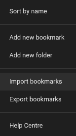
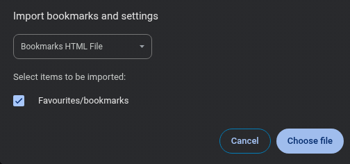

[[_TOC_]]

# Installing on Chrome & Chromium Browsers

Covers Chrome, Brave, Opera, Vivaldi.

---

## Steps

1. [Download EduQuick HTML](https://github.com/Ahmedallion/EduQuick/install/eduquick.html){: .btn .btn-purple target="\_blank" rel="noopener"}
   

2. Open bookmarks manager: `chrome://bookmarks`

3. Enable bookmarks bar: `Ctrl + Shift + B`

4. Click three dots → **Import bookmarks**
   
   

5. Select HTML file: `eduquick.html`
   

6. EduQuick appears in bookmarks bar

---

{: .note }

> Tip: Other Chromium browsers follow these same steps.
> Make sure you are logged into **Educake** before running EduQuick.
