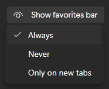
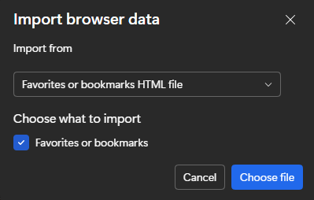

# Installing on Microsoft Edge

---

## Steps

### 1. Download the installer

To get started, download the EduQuick HTML installer file to your computer.

[Download EduQuick HTML](https://github.com/Ahmedallion/EduQuick/blob/main/install/eduquick.html){: .btn .btn-purple target="\_blank" rel="noopener"}

### 2. Open favorites manager

Navigate to the favorites manager by typing `edge://favorites` in your address bar.

### 3. Enable favorites bar

Ensure your favorites bar is set to **Always** so you can access the tool easily.

### 4. Import the file

Click the **three dots** (options menu) in the favorites manager, select **Import favorites**, and then click the **Import** button.

### 5. Select the HTML file

Find and select the `eduquick.html` file you downloaded in Step 1.

### 6. Success

EduQuick will now appear in your favorites bar.

 

{: .note }

> **Important:** Make sure you are logged into **Educake** before running EduQuick.
