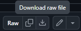
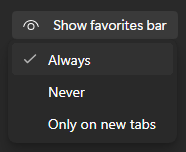
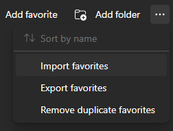
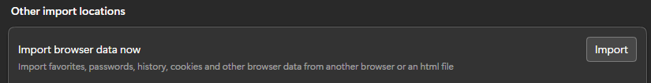
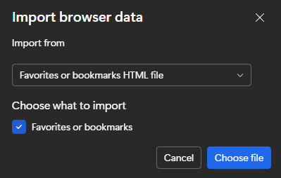

[[_TOC_]]

# Installing on Microsoft Edge

---

## Steps

1. [Download EduQuick HTML](https://github.com/Ahmedallion/EduQuick/install/eduquick.html){: .btn .btn-purple target="\_blank" rel="noopener"}
   

2. Open favorites manager: `edge://favorites`

3. Enable favorites bar → Always
   

4. Click three dots → **Import favorites** → **Import**
   
   

5. Select HTML file: `eduquick.html`
   

6. EduQuick appears in favorites bar

---

{: .note }

> Tip: Always log in to **Educake** before running EduQuick.
