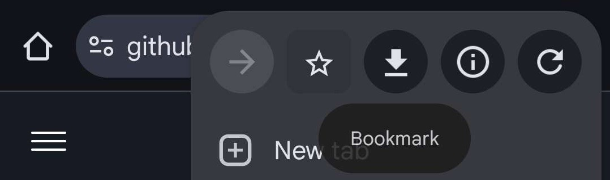

# Installing on Android (Limited Support)

Android browsers do not natively support standard bookmarklets, making the process more manual than on Desktop or iOS.

{: .warning }

> **Warning:** This method is discouraged as it may be inconsistent and requires manual steps each time you use it.

---

## Steps

### 1. Bookmark the repository

First, bookmark the EduQuick JS page in your mobile browser for easy access to the source code.

[Open EduQuick JS](https://github.com/Ahmedallion/EduQuick/blob/main/install/eduquick.js){: .btn .btn-purple target="\_blank" rel="noopener"}

### 2. Run the script manually

Because Android does not support "one-tap" bookmarks for scripts, you must perform these steps each time you want to use the tool:

**A. Copy the script**
Open the JS file you bookmarked in [Step 1](#1-bookmark-the-repository), then copy the entire code block.

**B. Execute in Educake**
Log into your Educake account. Clear your browser's address bar completely, paste the code (ensure it starts with `javascript:`), and press **Go** on your keyboard.

 

{: .note }

> **Tip:** If the browser removes the `javascript:` prefix when you paste, you will need to type it back in manually at the start of the line for the script to run.
