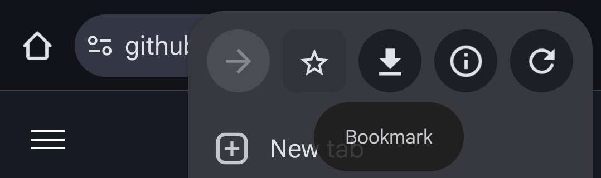
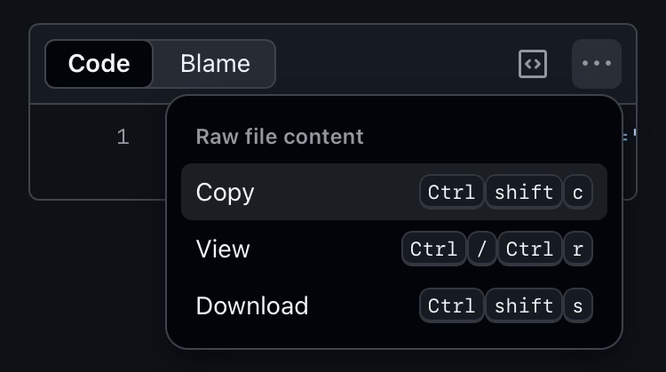

[[_TOC_]]

# Installing on Android (Limited Support)

Android browsers do not properly support bookmarklets.

{: .warning }

> Warning: This method is **strongly discouraged** and may not work.

---

## Steps

1. Bookmark the EduQuick repository
   

2. Each time you want to run EduQuick:
    - Copy JS from [`eduquick.js`](https://github.com/Ahmedallion/EduQuick/install/eduquick.js){: .btn .btn-purple target="\_blank" rel="noopener"}
      
    - Log into Educake
    - Clear the address bar, paste JS (starts with `javascript:`), press Go
      

---

{: .note }

> Tip: Android bookmarklets must be repeated each time and may break after browser updates.
