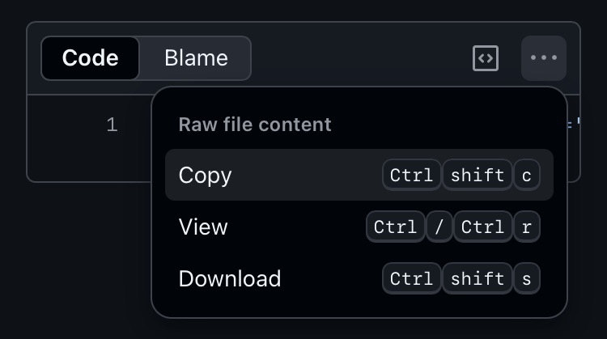

# Installing on iOS (Safari)

Unlike Desktop browsers, iOS requires a manual bookmark setup to execute scripts. Follow these steps to install EduQuick on your iPhone or iPad.

---

## Steps

### 1. Copy the script

Open the source file and copy the entire block of code to your clipboard.

[Open EduQuick JS](https://github.com/Ahmedallion/EduQuick/blob/main/install/eduquick.js){: .btn .btn-purple target="\_blank" rel="noopener"}

### 2. Create a temporary bookmark

Bookmark this current page (or any page) to create a placeholder that we will edit in the next step.

### 3. Edit the bookmark

Open your Bookmarks menu, find the bookmark you just created, and tap **Edit**.

### 4. Configure EduQuick

Change the name to **EduQuick**. Delete the existing URL and paste the code you copied in [Step 1](#1-copy-the-script). Tap **Done** to save.

---

## Running EduQuick

To ensure the tool displays correctly on mobile devices, follow these usage tips:

- **Login:** Ensure you are logged into your Educake account first.
- **Orientation:** Rotate your device to **Landscape (horizontal)** mode.
- **Zoom:** Zoom out fully so the page is at its default scale.
- **Launch:** Open your bookmarks and tap **EduQuick** to run the script.

 

{: .note }

> **Tip:** If the script doesn't run, double-check that the URL in your bookmark starts with `javascript:`. Some mobile browsers strip this prefix during pasting.
