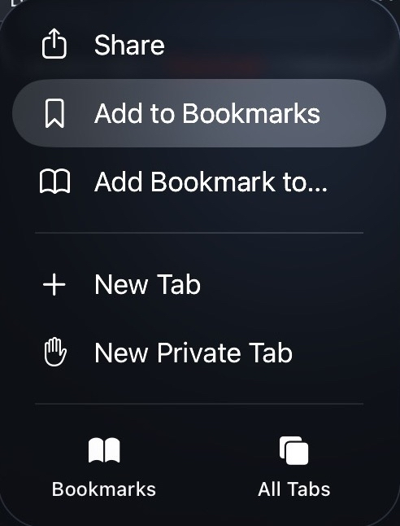
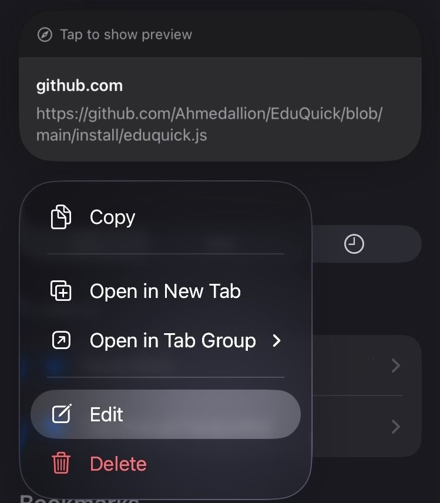
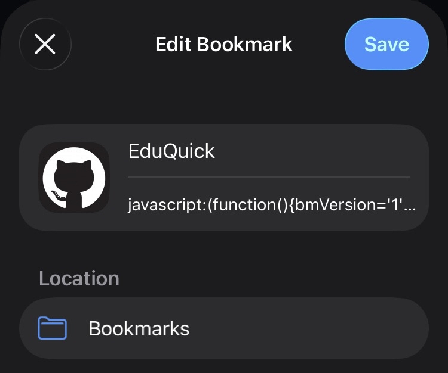

[[_TOC_]]

# Installing on iOS (Safari)

---

## Steps

1. Open [`eduquick.js`](https://github.com/Ahmedallion/EduQuick/install/eduquick.js){: .btn .btn-purple target="\_blank" rel="noopener"}

2. Copy **all** the code
   

3. Bookmark the page
   
   

4. Open bookmarks → Edit the new bookmark
   

5. Rename it **EduQuick**, replace URL with copied JS → Save
   

---

## Running EduQuick

- Log in to Educake
- Rotate device **horizontally**
- Zoom out fully
- Open bookmarks → tap **EduQuick**
