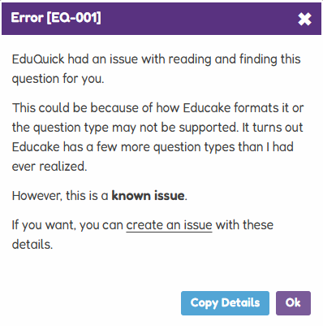

# EQ-001 – Question Type Not Supported

Resolved
{: .label .label-green }

This error occurs when EduQuick encounters a specific question format on Educake that it does not yet recognise.

---

## What causes this?

When you see the `EQ-001` error, it means EduQuick could not find the necessary data from the current question. This is typically due to:

- **New Question Layouts:** Recent updates to the Educake platform.
- **Complex Interactives:** Select or other questions that are still in development.

---

## Reporting This Issue

If you encounter this error on a quiz that is not yet supported, please report it so we can add compatibility for that question type.

[Report this on GitHub](https://github.com/Ahmedallion/EduQuick/issues){: .btn .btn-purple target="\_blank" rel="noopener"}

### Please provide these details:

- **Browser & Version:** (e.g., Chrome v121)
- **Quiz Subject:** (e.g., KS3 Science - Electricity)
- **Error Code:** `EQ-001`
- **Error Details:** Copy and paste the details shown in the error modal.

 

{: .note }

> **Tip:** If this happens, you can usually skip the specific question and run EduQuick again on the next one.
