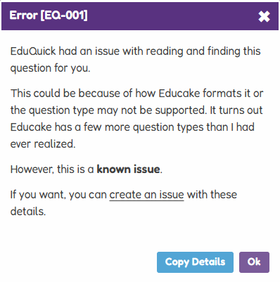

[[_TOC_]]

# EQ-001 – Question Type Not Supported

Patched
{: .label .label-green }

EduQuick failed to read a specific question.

This usually happens because Educake uses a question type that is not yet supported.

---

## Reporting This Issue

Include:

- Browser & version
- Quiz type
- Error code: `EQ-001`
- Copied error details from the modal
