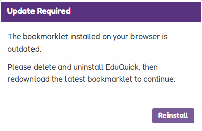

# EduQuick Updates

If you’ve received a message about updating, take a screenshot and follow these instructions.

This means your **bookmarklet is out of date**.

EduQuick automatically fetches the latest script version from GitHub, but sometimes the **bookmarklet itself** - the code that injects EduQuick into Educake - needs to be updated manually.

---

## 🔄 How to Update Your Bookmarklet

1. **Remove the old bookmarklet**
    - Right-click the **EduQuick** folder in your bookmarks bar
    - Select **Move to Bin** (or Delete)

2. **Reinstall using one of the methods below**

---

## 🚀 Installation (Bookmarklet)

### Option 1: Import HTML (Recommended)

1. Download  
   [`install/eduquick.html`](../../install/eduquick.html)
2. Open your bookmarks manager
    - Chrome / Edge: `chrome://bookmarks`
3. Drag & drop or import the HTML file
4. You’ll now have a bookmark folder called **EduQuick**

### Option 2: Manual Bookmarklet

1. Open  
   [`install/eduquick.js`](../../install/eduquick.js)
2. Copy **all** of its contents
3. Create a new bookmark:
    - **Name:** `EduQuick`
    - **URL:** paste the copied JavaScript
4. Save
