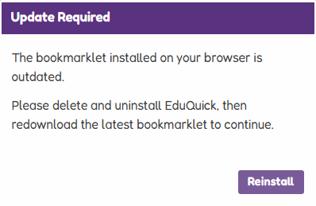

[[_TOC_]]

# EduQuick Updates

Sometimes EduQuick bookmarklets need to be manually updated.

---

## How to Update

1. Remove the old bookmarklet from your bookmarks/favorites
2. Reinstall using [Installation Guide](/installation){: .btn .btn-purple}
3. Ensure you always run the latest bookmarklet

{: .note }

> Tip: EduQuick automatically fetches the latest script version, but the bookmarklet itself may require manual updates.
